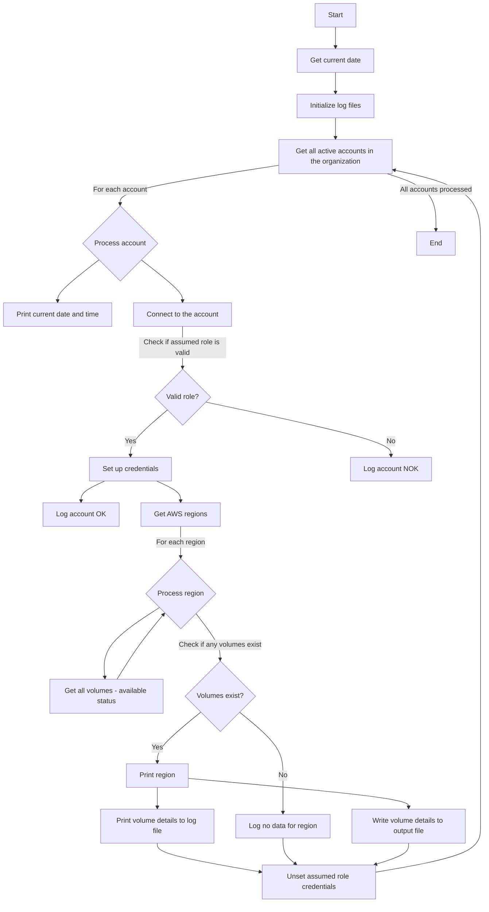

# Script to List all EBS Volumes Unattached

```mermaid
graph TD
    A[Start] --> B[Get current date]
    B --> D[Initialize log files]
    D --> E[Get all active accounts in the organization]
    
    E -->|For each account| F{Process account}
    F --> G[Print current date and time]
    
    F --> I[Connect to the account]
    I -->|Check if assumed role is valid| J{Valid role?}
    J -->|Yes| K[Set up credentials]
    J -->|No| L[Log account NOK]
    
    K --> M[Log account OK]
    K --> N[Get AWS regions]
    
    N -->|For each region| O{Process region}
    O --> P[Get all volumes - available status]
    
    O -->|Check if any volumes exist| Q{Volumes exist?}
    Q -->|Yes| R[Print region]
    R --> S[Write volume details to output file]
    R --> T[Print volume details to log file]
    
    Q -->|No| U[Log no data for region]
        
    T --> W[Unset assumed role credentials]
    
    U --> W
    S --> W
    P --> O
    W --> E
    
    Z[End]
    E -->|All accounts processed| Z

```